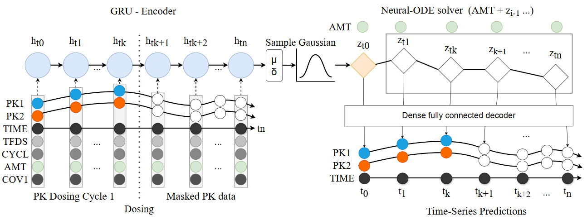
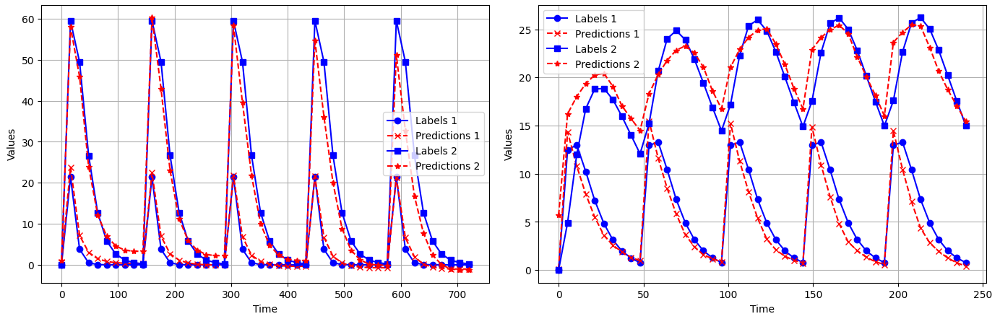

# Neural ODEs for Time Series Prediction
This repository provides a simple and modular implementation of neural ordinary differential equations (ODEs) for time series prediction. It is based on the work by James et al. (2021) (see https://github.com/jameslu01/Neural_PK) and extends their approach with additional features, refactoring and refinements for simple use and learning more about the topic.

# Background
Neural ODEs offer a powerful framework for modeling time-dependent data by combining neural networks with differential equations. They are particularly useful for handling irregularly sampled data and capturing complex temporal dynamics. In this example, neural ODEs are applied to simulated pharmacokinetic/pharmacodynamic (PK/PD) data, often used in modeling drug concentration and effect over time in a population.

# Key Features
Refactored and Modular Code: The implementation is designed for clarity and modularity, allowing for easy adaptation and experimentation.
Multiple Label Support: The code supports multi-label time series data, making it flexible for various prediction tasks.
PK/PD Simulation: Uses simulated PK/PD data to demonstrate practical application in population dynamics.

## GRU-Neural-ODE

## Simple test example:
 Results of fitted model on test set for multi-label predicitons (predicting 2 of 4 population pk simulated compartments over time, multiple dosing amounts, frequency and individual variability) See inspect_test_results.ipynb

### Literature: 

Lu, J., Deng, K., Zhang, X., Liu, G., & Guan, Y. (2021). Neural-ODE for pharmacokinetics modeling and its advantage to alternative machine learning models in predicting new dosing regimens. iScience, 24(7), 102804-. https://doi.org/10.1016/j.isci.2021.102804

Ricky T. Q. Chen, Yulia Rubanova, Jesse Bettencourt, David Duvenaud (2016). Neural Ordinary Differential Equations, https://doi.org/10.48550/arXiv.1806.07366
